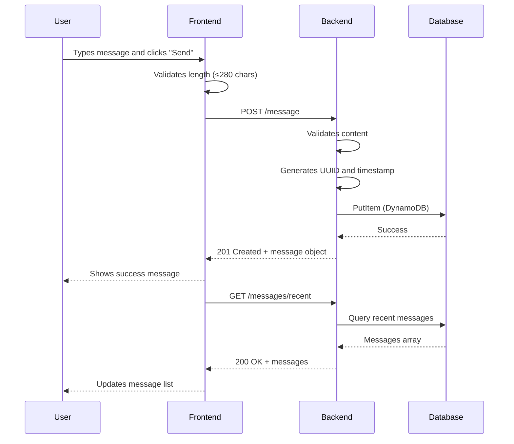
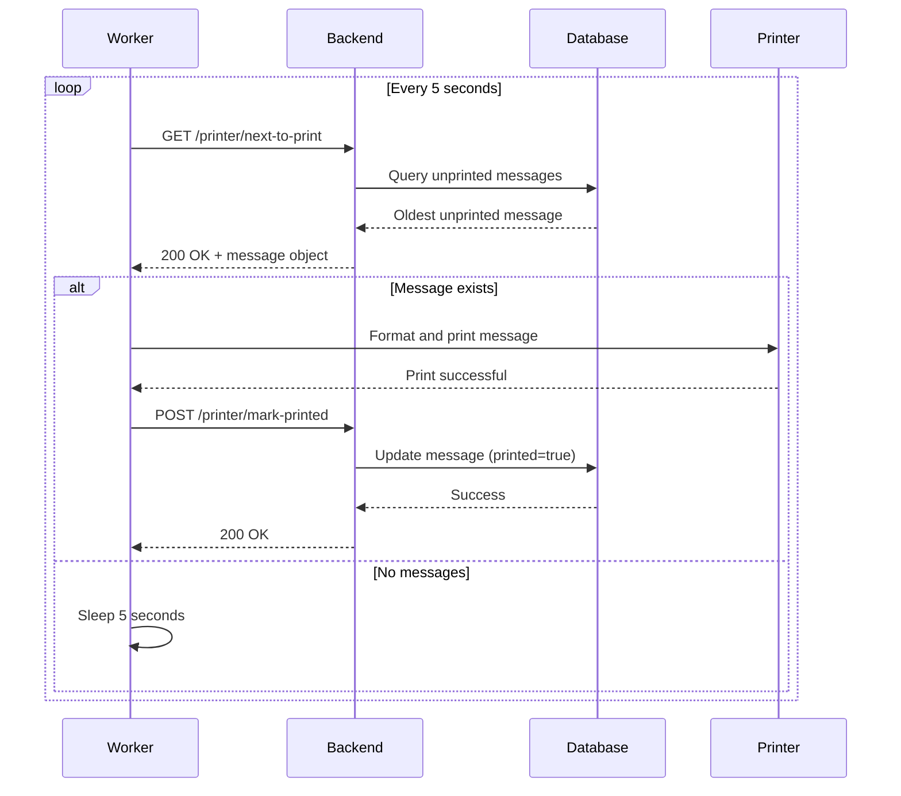
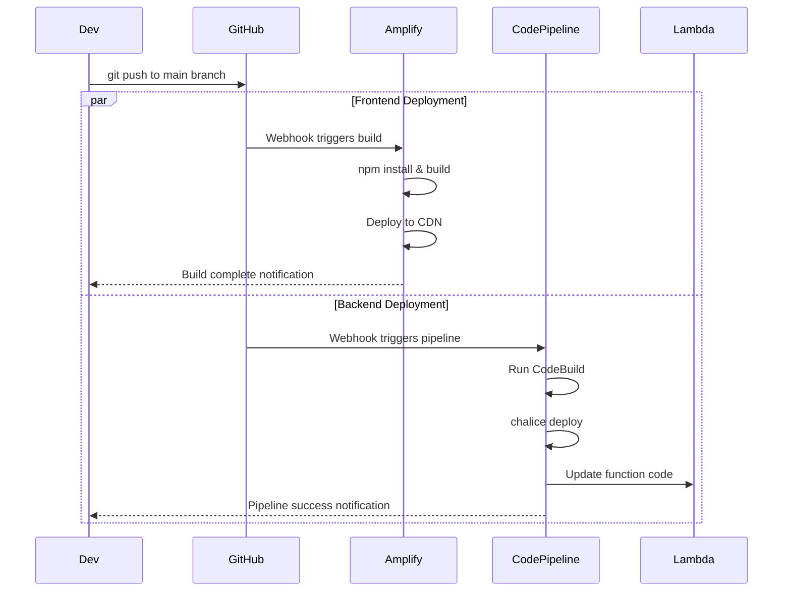

# Pennant - Agent Integration Contracts

This document defines the interfaces, data contracts, and coordination protocols between the four specialized agents working on the Pennant project.

## Table of Contents
1. [API Contracts](#api-contracts)
2. [Data Schemas](#data-schemas)
3. [Environment Variables](#environment-variables)
4. [Integration Flows](#integration-flows)
5. [Change Management](#change-management)
6. [Testing Contracts](#testing-contracts)

---

## API Contracts

The Backend Agent owns and maintains these REST API endpoints. All other agents consume these contracts.

### Base URL
- **Development**: `http://localhost:8000` (Chalice local)
- **Production**: `https://{api-id}.execute-api.{region}.amazonaws.com/prod`

### Authentication
- **Current**: None (public endpoints)
- **Future**: API key in `X-API-Key` header (when implemented by Infrastructure Agent)

### Common Headers
```
Content-Type: application/json
Accept: application/json
```

### Common Error Response Format
```json
{
  "error": "Human-readable error message",
  "code": "ERROR_CODE"  // optional
}
```

---

### 1. POST /message
**Owner**: Backend Agent  
**Consumers**: Frontend Agent

**Purpose**: Create a new message to be printed.

**Request**:
```http
POST /message HTTP/1.1
Content-Type: application/json

{
  "content": "string"
}
```

**Request Validation**:
- `content` is required
- `content` must not be empty after trimming whitespace
- `content` must be ≤ 280 characters
- `content` must be a string

**Success Response (201 Created)**:
```json
{
  "id": "f47ac10b-58cc-4372-a567-0e02b2c3d479",
  "content": "Hello from the internet!",
  "created_at": "2025-11-24T10:30:00.000Z",
  "printed": false,
  "printed_at": null
}
```

**Error Responses**:
- **400 Bad Request**: Invalid or missing content
  ```json
  {
    "error": "Message content is required and cannot be empty"
  }
  ```
  ```json
  {
    "error": "Message too long (max 280 characters)"
  }
  ```
- **500 Internal Server Error**: Database write failure
  ```json
  {
    "error": "Internal server error"
  }
  ```

**CORS**: Enabled (required for frontend)

**Frontend Integration Notes**:
- Display loading state while request is in flight
- Show success message on 201 response
- Display error message from response body on 4xx/5xx
- Refresh message list after successful creation

---

### 2. GET /messages/recent
**Owner**: Backend Agent  
**Consumers**: Frontend Agent

**Purpose**: Retrieve the 10 most recent messages (for display on website).

**Request**:
```http
GET /messages/recent HTTP/1.1
```

**Query Parameters**: None

**Success Response (200 OK)**:
```json
{
  "messages": [
    {
      "id": "f47ac10b-58cc-4372-a567-0e02b2c3d479",
      "content": "Hello from the internet!",
      "created_at": "2025-11-24T10:30:00.000Z",
      "printed": true,
      "printed_at": "2025-11-24T10:30:15.000Z"
    },
    {
      "id": "a1b2c3d4-e5f6-4789-a012-b3c4d5e6f789",
      "content": "Another message",
      "created_at": "2025-11-24T10:25:00.000Z",
      "printed": false,
      "printed_at": null
    }
  ]
}
```

**Response Characteristics**:
- Array sorted by `created_at` descending (newest first)
- Maximum 10 messages returned
- Empty array if no messages exist: `{"messages": []}`

**Error Responses**:
- **500 Internal Server Error**: Database read failure

**CORS**: Enabled (required for frontend)

**Frontend Integration Notes**:
- Call on page load
- Optional: Poll every 10-30 seconds for updates
- Display printed status visually (e.g., checkmark icon)
- Format timestamps for user readability

---

### 3. GET /printer/next-to-print
**Owner**: Backend Agent  
**Consumers**: Hardware Agent

**Purpose**: Retrieve the oldest unprinted message (for printer worker).

**Request**:
```http
GET /printer/next-to-print HTTP/1.1
```

**Success Response (200 OK) - Message Available**:
```json
{
  "message": {
    "id": "f47ac10b-58cc-4372-a567-0e02b2c3d479",
    "content": "Hello from the internet!",
    "created_at": "2025-11-24T10:30:00.000Z",
    "printed": false,
    "printed_at": null
  }
}
```

**Success Response (200 OK) - No Messages**:
```json
{
  "message": null
}
```

**Response Characteristics**:
- Returns single oldest message where `printed == false`
- Returns `null` if no unprinted messages exist
- Sorted by `created_at` ascending (oldest first)

**Error Responses**:
- **500 Internal Server Error**: Database read failure

**CORS**: Enabled

**Hardware Integration Notes**:
- Poll this endpoint every 5-10 seconds
- If `message` is `null`, sleep and retry
- If message is returned, print it and then call `/printer/mark-printed`
- Handle 500 errors gracefully (log and retry after delay)

---

### 4. POST /printer/mark-printed
**Owner**: Backend Agent  
**Consumers**: Hardware Agent

**Purpose**: Mark a message as printed (called by Pi worker after successful print).

**Request**:
```http
POST /printer/mark-printed HTTP/1.1
Content-Type: application/json

{
  "id": "f47ac10b-58cc-4372-a567-0e02b2c3d479"
}
```

**Request Validation**:
- `id` is required
- `id` must be a valid UUID string

**Success Response (200 OK)**:
```json
{
  "status": "ok",
  "id": "f47ac10b-58cc-4372-a567-0e02b2c3d479"
}
```

**Behavior**:
- Sets `printed = true`
- Sets `printed_at` to current ISO 8601 timestamp
- Idempotent: calling multiple times with same ID is safe

**Error Responses**:
- **400 Bad Request**: Missing or invalid ID
  ```json
  {
    "error": "Missing id"
  }
  ```
- **404 Not Found** (optional): Message ID doesn't exist
  ```json
  {
    "error": "Message not found"
  }
  ```
- **500 Internal Server Error**: Database update failure

**CORS**: Enabled

**Hardware Integration Notes**:
- Call immediately after successful print
- If call fails (network error), log warning and continue
  - Message will remain unprinted in DB
  - Pi will fetch it again on next poll (duplicate print acceptable)
- Retry logic: Optional exponential backoff (3 attempts)

---

## Data Schemas

### Message Object

**Canonical Schema** (owned by Backend Agent):

```typescript
interface Message {
  id: string;              // UUID v4 format
  content: string;         // Message text, 1-280 characters
  created_at: string;      // ISO 8601 timestamp (UTC), e.g., "2025-11-24T10:30:00.000Z"
  printed: boolean;        // Whether message has been printed
  printed_at: string | null;  // ISO 8601 timestamp when printed, or null if not printed
}
```

**DynamoDB Storage** (Infrastructure Agent provisions):

```python
{
  "id": "f47ac10b-58cc-4372-a567-0e02b2c3d479",  # String (PK)
  "content": "Hello from the internet!",          # String
  "created_at": "2025-11-24T10:30:00.000Z",      # String
  "printed": False,                               # Boolean
  "printed_at": None                              # String or Null
}
```

**Field Specifications**:

| Field | Type | Nullable | Validation | Notes |
|-------|------|----------|------------|-------|
| `id` | String (UUID) | No | UUID v4 format | Generated by backend |
| `content` | String | No | 1-280 chars | User-provided message |
| `created_at` | String (ISO 8601) | No | Valid ISO 8601 UTC | Generated by backend |
| `printed` | Boolean | No | true or false | Default: false |
| `printed_at` | String (ISO 8601) | Yes | Valid ISO 8601 UTC or null | Set when marked printed |

---

## Environment Variables

### Frontend Agent

**Required**:
- `NEXT_PUBLIC_API_BASE_URL`: Backend API base URL
  - **Development**: `http://localhost:8000`
  - **Production**: `https://{api-id}.execute-api.{region}.amazonaws.com/prod`
  - **Set by**: Infrastructure Agent (via Amplify console)

**Optional**:
- `NEXT_PUBLIC_DOMAIN`: Display domain (e.g., "pennant.example.com")

### Backend Agent

**Required**:
- `DYNAMODB_TABLE`: DynamoDB table name
  - **Development**: `pennant-messages-dev`
  - **Production**: `pennant-messages-prod`
  - **Set by**: Infrastructure Agent (via Chalice config or environment)

**Optional**:
- `AWS_REGION`: AWS region (default: `us-east-1`)
- `LOG_LEVEL`: Logging level (default: `INFO`)

### Infrastructure Agent

**Required**:
- `AWS_ACCOUNT_ID`: AWS account ID (for IAM policies)
- `AWS_REGION`: Deployment region (e.g., `us-east-1`)
- `GITHUB_REPO`: Repository URL for CI/CD

**Optional**:
- `DOMAIN_NAME`: Custom domain (e.g., `pennant.example.com`)
- `ROUTE53_HOSTED_ZONE_ID`: Route 53 hosted zone ID

### Hardware Agent

**Hardcoded in Script** (update before deployment):
- `API_BASE`: Backend API base URL
  - Example: `https://abc123xyz.execute-api.us-east-1.amazonaws.com/prod`
- `VENDOR_ID`: USB printer vendor ID (from `lsusb`)
  - Example: `0x0fe6`
- `PRODUCT_ID`: USB printer product ID (from `lsusb`)
  - Example: `0x811e`

**Optional Configuration**:
- `POLL_INTERVAL_SECONDS`: Time between API polls (default: 5)
- `REQUEST_TIMEOUT_SECONDS`: HTTP request timeout (default: 10)

---

## Integration Flows

### Flow 1: User Submits Message



**Agent Responsibilities**:
- **Frontend**: Input validation, API calls, UI updates, error display
- **Backend**: Request validation, UUID generation, database write, response formatting
- **Infrastructure**: API Gateway routing, DynamoDB availability, CloudWatch logging

---

### Flow 2: Printer Worker Prints Message



**Agent Responsibilities**:
- **Hardware**: Polling loop, printer communication, error recovery, marking printed
- **Backend**: Query optimization, status updates, idempotent mark-printed
- **Infrastructure**: DynamoDB indexes for efficient queries, API Gateway availability

---

### Flow 3: Deployment Pipeline



**Agent Responsibilities**:
- **Frontend**: Maintain build configuration, dependencies, build scripts
- **Backend**: Maintain Chalice config, requirements.txt, deployment settings
- **Infrastructure**: Configure Amplify app, CodePipeline, IAM roles, notifications

---

## Change Management

### When Backend Agent Changes API Contract

**Breaking Changes** (require coordination):
- Adding/removing endpoints
- Changing request/response schema
- Modifying required fields
- Changing error codes or formats
- Adding authentication requirements

**Process**:
1. Backend Agent proposes change with migration plan
2. Notify Frontend Agent (if affects their endpoints)
3. Notify Hardware Agent (if affects their endpoints)
4. Infrastructure Agent may need to update IAM policies
5. Implement with versioning or feature flags if possible
6. Update this contract document
7. Deploy backend changes first
8. Deploy dependent agents second (frontend, hardware)

**Non-Breaking Changes** (no coordination needed):
- Adding optional fields to responses
- Adding new endpoints (not removing old ones)
- Improving error messages (same codes)
- Performance optimizations
- Adding more detailed logging

---

### When Frontend Agent Changes UI

**No Coordination Needed**:
- UI layout and styling changes
- Animation and interaction improvements
- Adding new frontend-only features
- Client-side validation changes

**Requires Backend Coordination**:
- New data requirements (may need new endpoints)
- Authentication UI (if backend adds auth)
- Different request formats (must align with API)

---

### When Infrastructure Agent Changes Infrastructure

**Breaking Changes** (require coordination):
- Changing API Gateway URL (all agents need new URL)
- Adding authentication (Backend + Frontend + Hardware update)
- Changing DynamoDB table name (Backend needs update)
- Region changes (all agents need new URLs)

**Non-Breaking Changes** (no coordination needed):
- Capacity adjustments (DynamoDB, Lambda)
- Monitoring and alerting setup
- Cost optimization changes
- IAM policy refinements (if permissions stay same or expand)

---

### When Hardware Agent Changes Worker

**No Coordination Needed**:
- Print format changes
- Polling interval adjustments
- Error handling improvements
- Logging enhancements

**Requires Backend Coordination**:
- Changing API call patterns (e.g., batch requests)
- New endpoints or features needed
- Authentication implementation

---

## Testing Contracts

### Frontend Tests Should Verify

- **API Integration**:
  - ✅ POST /message with valid content returns 201
  - ✅ POST /message with empty content returns 400
  - ✅ POST /message with >280 chars returns 400
  - ✅ GET /messages/recent returns array of messages
  - ✅ API errors display user-friendly messages

- **UI Behavior**:
  - ✅ Character counter updates as user types
  - ✅ Submit button disabled during API call
  - ✅ Success message shown after submission
  - ✅ Message list refreshes after submission

### Backend Tests Should Verify

- **Endpoint Behavior**:
  - ✅ POST /message creates message in DynamoDB
  - ✅ POST /message generates valid UUID
  - ✅ POST /message validates content length
  - ✅ GET /messages/recent returns max 10 messages
  - ✅ GET /messages/recent sorts by created_at desc
  - ✅ GET /printer/next-to-print returns oldest unprinted
  - ✅ GET /printer/next-to-print returns null when none exist
  - ✅ POST /printer/mark-printed updates printed status
  - ✅ POST /printer/mark-printed is idempotent

- **Error Handling**:
  - ✅ 400 for invalid inputs
  - ✅ 500 for database failures
  - ✅ CORS headers present on all responses

### Infrastructure Tests Should Verify

- **Resource Provisioning**:
  - ✅ DynamoDB table exists with correct schema
  - ✅ GSI on printed+created_at exists
  - ✅ Lambda has DynamoDB read/write permissions
  - ✅ API Gateway has CORS enabled
  - ✅ Amplify app deploys successfully

- **CI/CD**:
  - ✅ Frontend builds and deploys on push to main
  - ✅ Backend deploys via CodePipeline on push to main
  - ✅ Environment variables are set correctly

### Hardware Tests Should Verify

- **Worker Functionality**:
  - ✅ Worker connects to printer successfully
  - ✅ Worker fetches messages from API
  - ✅ Worker prints message content correctly
  - ✅ Worker marks message as printed after print
  - ✅ Worker handles printer disconnect gracefully
  - ✅ Worker handles API errors gracefully
  - ✅ Worker recovers from network failures

- **Systemd Service**:
  - ✅ Service starts on boot
  - ✅ Service restarts on crash
  - ✅ Logs are accessible via journalctl

---

## Quick Reference

### Agent Communication Matrix

|               | **Frontend** | **Backend** | **Infrastructure** | **Hardware** |
|---------------|--------------|-------------|-------------------|--------------|
| **Frontend**  | -            | Consumes API| Needs env vars    | No contact   |
| **Backend**   | Provides API | -           | Needs DB & IAM    | Provides API |
| **Infrastructure** | Provisions Amplify | Provisions Lambda/DB/API | - | No contact |
| **Hardware**  | No contact   | Consumes API| Needs API URL     | -            |

### Dependency Chain

1. **Infrastructure Agent** provisions resources first
   - DynamoDB table
   - IAM roles
   - API Gateway (Chalice does this)
   - Amplify app

2. **Backend Agent** deploys API second
   - Needs DynamoDB table from Infrastructure
   - Provides API URL for Frontend and Hardware

3. **Frontend Agent** deploys UI third
   - Needs API URL from Backend
   - Needs Amplify app from Infrastructure

4. **Hardware Agent** configures worker last
   - Needs API URL from Backend
   - Independent of other agents

### Critical URLs to Share

- **Backend API URL**: Infrastructure Agent → Frontend Agent + Hardware Agent
- **Frontend URL**: Infrastructure Agent → Everyone (for testing)
- **DynamoDB Table Name**: Infrastructure Agent → Backend Agent

---

## Version History

| Version | Date | Changes | Updated By |
|---------|------|---------|------------|
| 1.0 | 2025-11-24 | Initial contract definition | Infrastructure Agent |

---

**Notes**: This document is the source of truth for agent integration. All agents must follow these contracts. Changes to contracts require updating this document and notifying affected agents.

